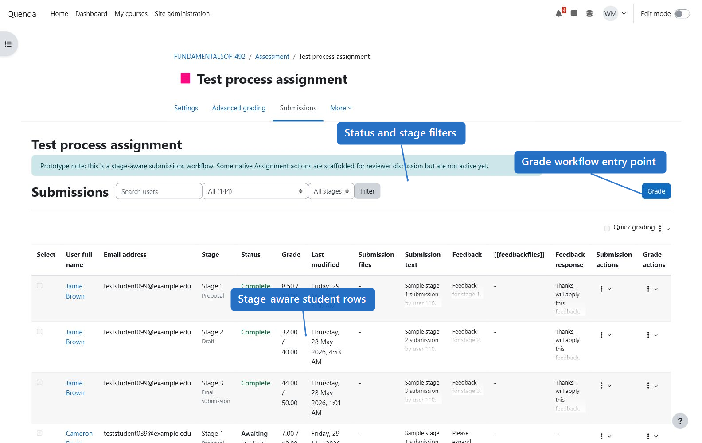
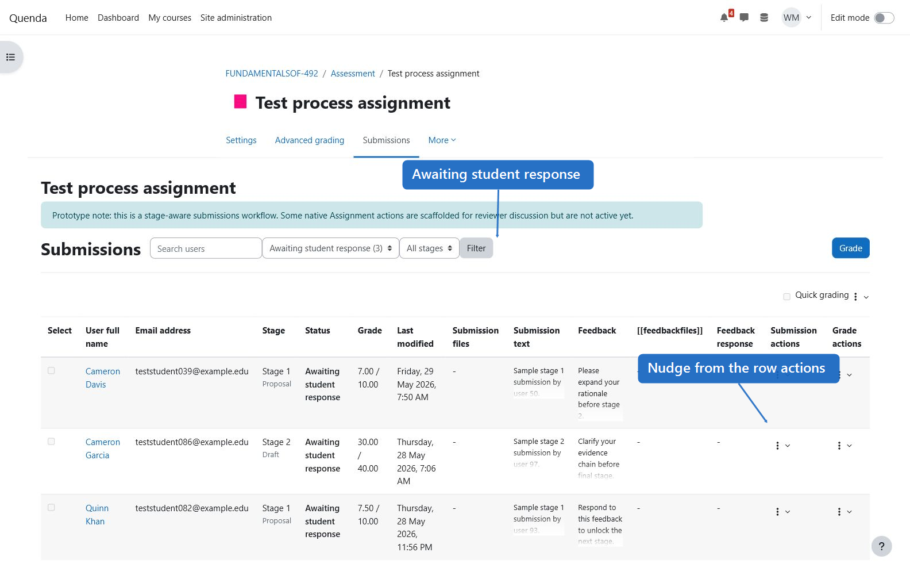
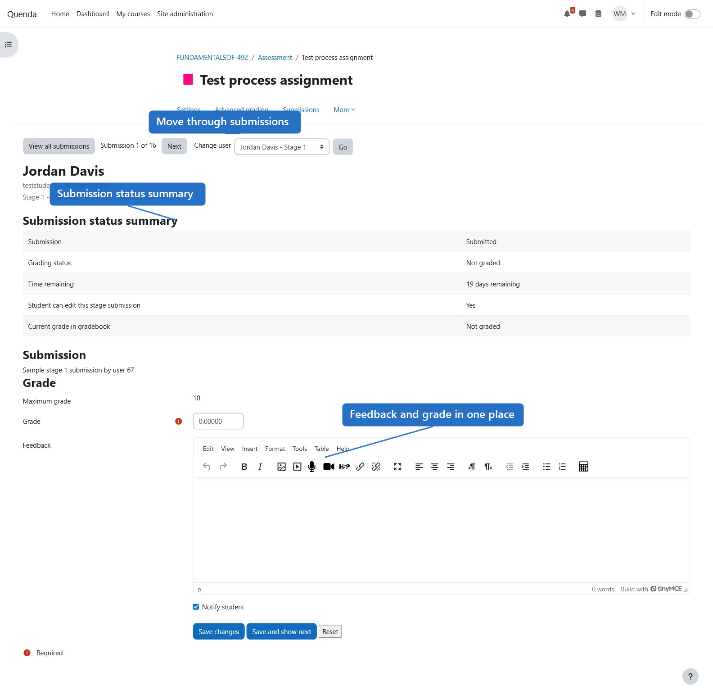
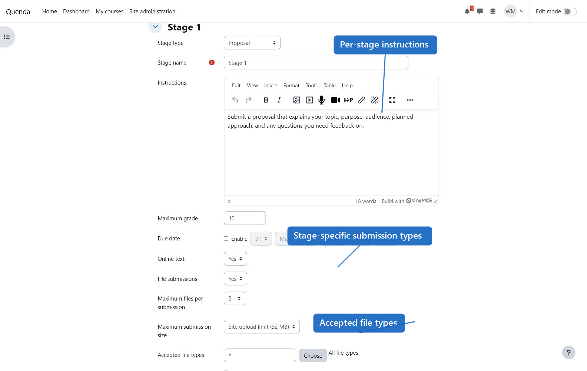
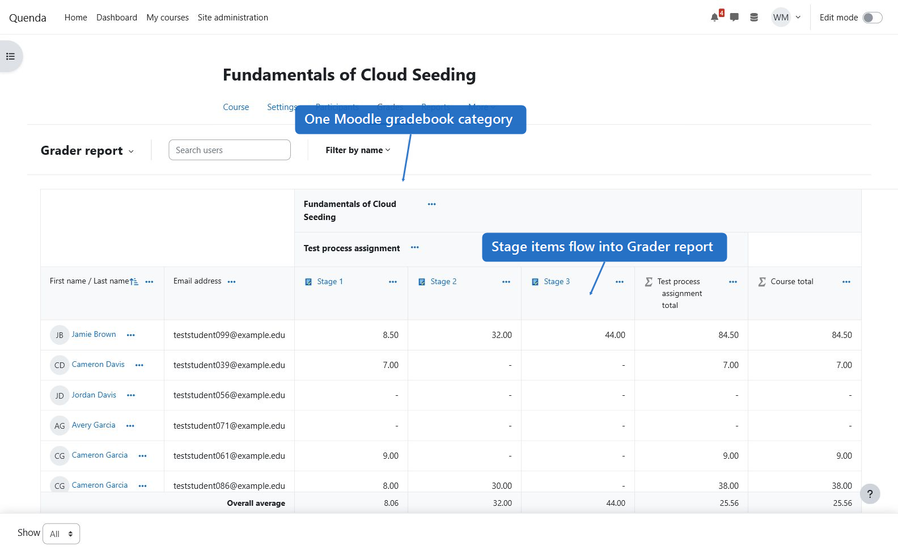
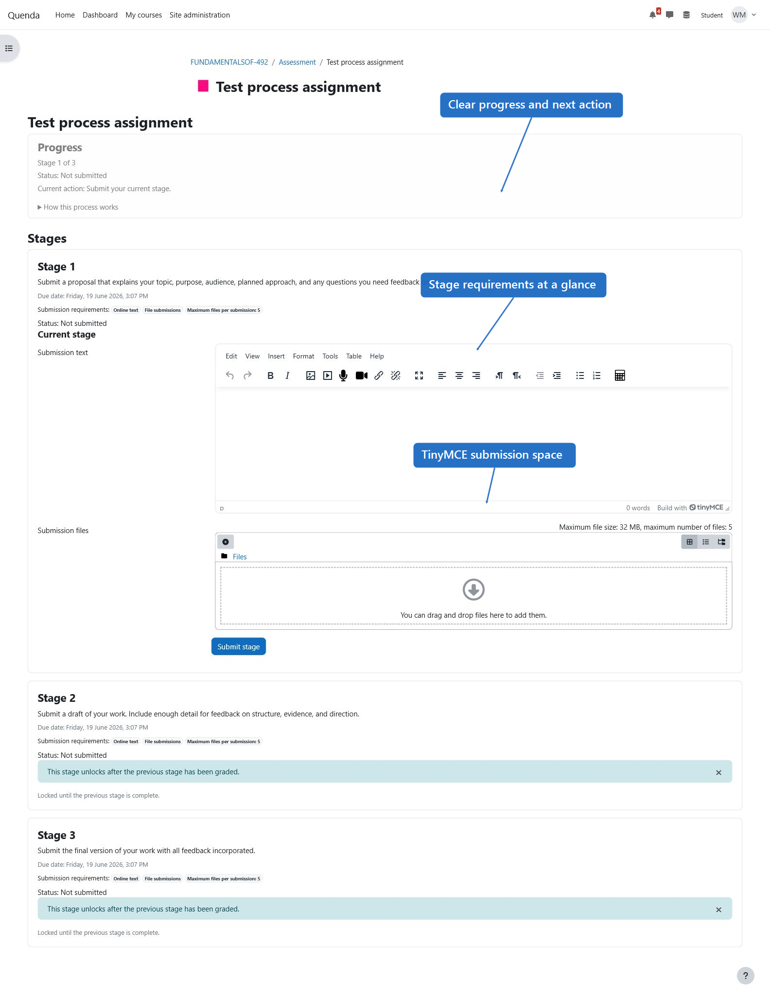

# Moodle Process Assignment prototype

`mod_processassign` is a Moodle activity prototype for staged, process-oriented assignment submission and grading.

The goal is to support assessment designs where students submit evidence in multiple stages, receive feedback and a stage grade, then unlock the next stage. This keeps the learning process inside Moodle instead of moving students and staff to an external platform.

For the broader rationale, use cases, MVP requirements, risks, and review questions, see the [Process Assignment product brief](docs/process-assignment-product-brief.md).

## Current capabilities

- Course activity type: **Process assignment**.
- Up to five ordered stages per activity.
- Stage settings: name, instructions, maximum grade, due date, online text, file submissions, file limits, accepted file types, and optional word limit.
- Stage types: custom, proposal, outline, draft, revision plan, reflection, research log, media prototype, final submission.
- Default stage prompts are supplied when a stage type is selected and instructions are left blank.
- Optional feedback-response gate: students can be required to respond to feedback before the next stage unlocks.
- Per-stage visibility controls for released grades and feedback.
- Activity settings modelled on core Assignment:
  - allow submissions from date
  - due date
  - final cutoff date
  - remind me to grade by date
  - online text submissions
  - file submissions
  - maximum file count
  - maximum upload size
  - require students to click a submit button
  - require students to accept the submission statement
  - allowed attempts and grant attempts settings
  - grader/student email notification toggles
- Student workflow:
  - sees all stages
  - sees a previous-stage history panel with released grades, feedback, and feedback responses
  - can submit only the current unlocked stage
  - submitted stages close off and show an explicit edit option while the stage is still open
  - next stage unlocks after the current stage is graded
  - online text uses Moodle editor configuration, including editor-managed media where enabled
- Teacher workflow:
  - sees students and stages in an action dashboard
  - sees a grading summary with visibility, participants, submitted count, and needs grading count
  - filters by awaiting feedback, awaiting response, late, not started, or complete
  - grades each stage
  - nudges students from the dashboard using a prepared email
  - releases feedback
  - can use Moodle advanced grading methods per stage area (`stage1` to `stage5`)
- Gradebook:
  - default mode pushes one aggregate activity grade to Moodle gradebook, like core Assignment
  - optional stage category mode creates a Moodle grade category for the activity and one child grade item per configured stage
  - in stage category mode, stage maximum grades act as the stage weightings (for example, 10 + 90 creates a 10/90 split)
  - the normal Moodle Grade category selector can be used to place the auto-created stage category under an existing course category

## Install in a Moodle sandbox

Tested in a local sandbox on Moodle **5.1.4+ (Build: 20260604)**. Moodle 5.1 places web-accessible code under the `public` directory, so in that layout copy this folder to:

```text
public/mod/processassign
```

For Moodle 4.5-style layouts, copy this folder to:

```text
mod/processassign
```

Then run:

```bash
php admin/cli/upgrade.php --non-interactive
php admin/cli/purge_caches.php
```

The activity should then appear in the Moodle activity picker as **Process assignment**.

## Screenshots

These screenshots show the current prototype in a Moodle sandbox with sample staged submissions.














## Suggested smoke test

1. Create a Process assignment with three stages.
2. Enable online text and file submissions.
3. Optionally select Rubric or Marking guide for one or more stage grading areas in the activity settings.
4. Log in as a student and submit stage 1.
5. Log in as a teacher and grade stage 1.
6. If feedback response is enabled, confirm stage 2 stays locked until the student responds to feedback.
7. Confirm the teacher dashboard filters show awaiting feedback, awaiting response, late, not started, and complete rows.
8. Grade all stages and confirm the aggregate grade appears in the Moodle gradebook.
9. Switch Gradebook mode to **Stage grade category**, set stage maximum grades to values such as 10 and 90, and confirm the stage items appear inside an activity category in the Moodle gradebook.

## Known prototype limitations

- Stage count is capped at five and advanced grading areas are static (`stage1` to `stage5`).
- Stage templates are currently simple stage types with default prompt text, not full multi-stage assignment recipes.
- Stage time limits are stored in the schema for future work but are not exposed in the staff UI until timer behaviour is implemented.
- Allowed attempts and grant-attempt settings are captured in the UI/schema but need deeper implementation before production use.
- Backup and restore scaffolding is implemented for activity settings, stages, user submissions, and submission files, but needs deeper testing.
- Group submissions, marking workflow, blind marking, marking allocation, extension overrides, and full submission-attempt history are not implemented yet.
- Notifications currently use direct email rather than Moodle message providers.
- The teacher review interface is intentionally basic.
- Stage category mode creates Moodle gradebook structures, but wider testing is needed for edge cases such as switching modes after manual gradebook changes.
- Stage editing after student submissions is conservative but still needs stronger UX and validation.
- There are no PHPUnit or Behat tests yet.

## Review questions

- Should this remain a standalone activity module, or should parts become Assignment subplugins?
- Is the current gradebook model right: simple aggregate by default, with optional auto-created per-stage grade category for heavier assessment designs?
- What is the best Moodle-native model for dynamic stage-level advanced grading areas beyond the current five-stage prototype?
- Which Assignment features should be treated as must-have before a pilot?
- How should reflection, feedback response, and learning-process evidence be represented in the UI?

## GitHub handoff checklist

- Repository name suggestion: `moodle-mod_processassign`.
- Add this plugin folder as the repository root, not the full Moodle installation.
- Confirm `version.php` targets the intended Moodle branch before wider testing.
- Moodle 5.1 compatibility smoke tested against the local sandbox, including install/upgrade, settings form, submissions dashboard, grader page, and gradebook page.
- Ask reviewers to focus first on architecture, Moodle API usage, advanced grading integration, privacy implementation, and whether the standalone activity approach is correct.
- Do not treat this as production-ready until backup/restore has been fully exercised, automated tests, group workflows, and message providers are implemented.
